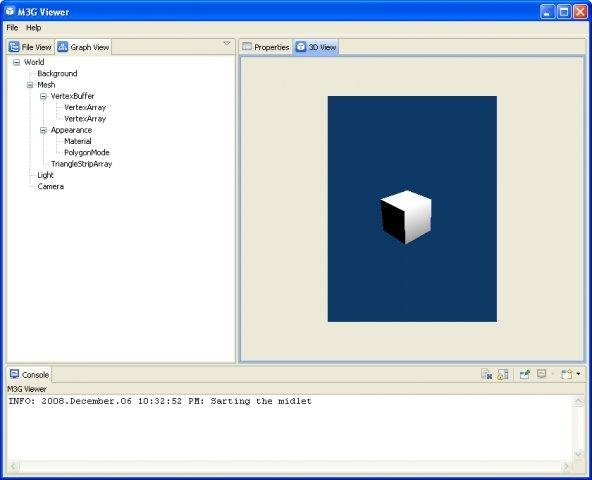
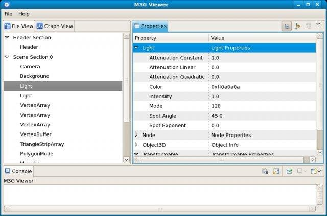

# M3G-Viewer
Copyright © 2008, Wizzer Works 

The M3G Viewer is a standalone application for viewing the contents of the 3D Graphics File Format that complements the Mobile 3D Graphics API (M3G).

This is a mirror of [sourceforge](https://sourceforge.net/projects/wz-m3gvw/).

<figure class="image">
  
  <figcaption>M3G Viewer on Windows XP: 3D View</figcaption>
</figure>
 
<figure class="image">
  
  <figcaption>M3G Viewer on Linux: File View</figcaption>
</figure>